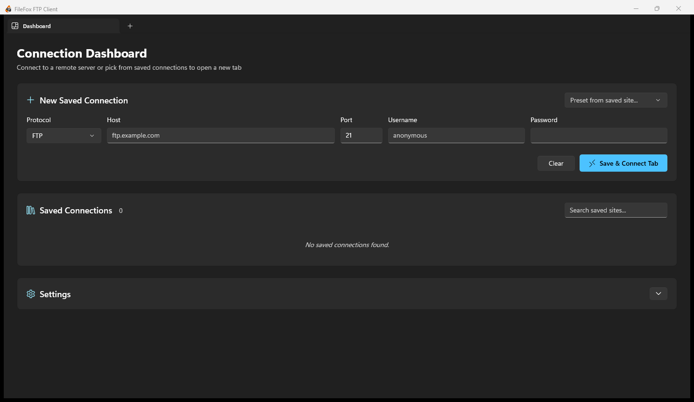

# FileFox FTP Client

[](LICENSE)
[](https://dotnet.microsoft.com/)
[](https://github.com/microsoft/WindowsAppSDK)
[](https://www.microsoft.com/windows)
[](https://github.com/uponatime2019/FileFox)

**FileFox FTP Client** is a modern, native Windows desktop client for **FTP**, **FTPS**, and **SFTP**, built with **WinUI 3**, **Windows App SDK**, and **.NET 8**.

Designed from the ground up for Windows 11 and Windows 10, FileFox delivers a clean, Fluent Design experience with Mica material backdrops, seamless dark/light modes, and a multi-tabbed interface for managing multiple remote connections side by side.

<p align="center">
  
</p>

---

## ✨ Features

- **Multi-Protocol Support**:
  - Standard FTP
  - FTPS Explicit TLS
  - FTPS Implicit TLS
  - SFTP (SSH File Transfer Protocol)
- **Tabbed Multi-Session Interface**:
  - Connect to multiple servers concurrently in separate tabs using native WinUI 3 `TabView`.
  - Dedicated Connection Dashboard tab for quick-connect and profile management.
- **Connection Dashboard & Site Manager**:
  - Save server profiles (host, port, protocol, credentials) for one-click access.
  - Searchable list of saved connections.
  - Credentials securely handled without plain-text password persistence.
- **Dual-Pane File Explorer**:
  - Side-by-side local and remote filesystem navigation.
  - Create, rename, and delete remote directories.
  - Real-time directory refresh and path navigation.
- **Sequential Transfer Queue**:
  - Background multi-file upload and download queue.
  - Real-time progress monitoring and transfer cancellation.
- **Built-in Remote File Editor**:
  - View, inspect, and modify remote text and source code files directly without external software.
- **Security & Validation**:
  - Strict certificate validation for FTPS sessions.
  - Trust-on-First-Use (TOFU) host-key confirmation and SHA-256 fingerprint pinning for SFTP.
- **System Integration**:
  - Native Windows 11 **Mica backdrop** and Fluent Design System styling.
  - Full support for Windows Light and Dark themes.
  - Notification area (system tray) support with single-instance restoration.
  - Close-to-tray and optional launch-on-startup options.
  - Session activity logging in local app data.

---

## 🛠️ Architecture & Tech Stack

FileFox is a 100% clean C# implementation built on modern open-source foundations:

| Component | Technology | Purpose |
| :--- | :--- | :--- |
| **Runtime** | [.NET 8](https://dotnet.microsoft.com/) | Modern, high-performance C# runtime |
| **UI Framework** | [WinUI 3](https://github.com/microsoft/microsoft-ui-xaml) / [Windows App SDK](https://github.com/microsoft/WindowsAppSDK) | Native Windows UI with Mica & Fluent styling |
| **FTP / FTPS Engine** | [FluentFTP](https://github.com/robinrodricks/FluentFTP) | Robust, feature-rich FTP and FTPS client |
| **SFTP Engine** | [SSH.NET](https://github.com/sshnet/SSH.NET) | Secure SSH / SFTP communication |
| **System Tray** | [H.NotifyIcon](https://github.com/HavenDV/H.NotifyIcon) | Windows notification area icon & tray management |

### Project Structure

```
FileFox/
├── Assets/                 # Application icons, tiles, and splash screen assets
├── Helpers/                # Win32 window management, paths, and commands
├── Models/                 # Connection profiles, file items, transfer data structures
├── Properties/             # Launch profiles and platform publish configurations
├── Services/               # Core remote file systems (FTP, SFTP), site manager, queue, logging
├── Views/                  # WinUI controls (DashboardView, ConnectionSessionView, FileEditorView)
├── App.xaml / .cs          # Application lifecycle, single-instance mutex, tray init
├── MainWindow.xaml / .cs   # Main application window, tab view container, backdrop
├── FileFox.csproj          # .NET 8 / WinUI 3 project definition (Unpackaged)
├── FileFox.sln             # Visual Studio solution file
└── app.manifest            # Per-monitor V2 DPI awareness and OS compatibility manifest
```

---

## 🚀 Getting Started

### Prerequisites

1. **Operating System**: Windows 10 version 1809 (Build 17763) or newer / Windows 11.
2. **.NET 8 SDK**: Download the latest [.NET 8 SDK](https://dotnet.microsoft.com/download/dotnet/8.0).
3. **IDE / Tools**:
   - [Visual Studio 2022](https://visualstudio.microsoft.com/) (v17.8 or later) with the following workloads:
     - **.NET Desktop Development**
     - **Windows application development** (Single-project MSIX Packaging Tools)
   - *OR* Visual Studio Code / JetBrains Rider with .NET 8 and Windows App SDK build tools.

### Building from Source

1. **Clone the repository**:
   ```bash
   git clone https://github.com/uponatime2019/FileFox.git
   cd FileFox
   ```

2. **Restore NuGet dependencies and build**:
   ```bash
   dotnet restore FileFox.csproj
   dotnet build FileFox.csproj -c Debug -p:Platform=x64
   ```

3. **Run the application**:
   ```bash
   dotnet run --project FileFox.csproj -p:Platform=x64
   ```

> [!NOTE]
> WinUI 3 requires specifying an architecture-specific platform such as `x64` or `ARM64`. Building for `AnyCPU` is not supported by the Windows App SDK.

---

## 🗺️ Roadmap & Milestones

- [x] Initial milestone: FTP, FTPS (Explicit & Implicit), SFTP
- [x] WinUI 3 TabView multi-session browsing
- [x] Connection dashboard & saved site profiles
- [x] Remote and local dual-pane file management
- [x] Sequential transfer queue (upload & download)
- [x] Built-in remote file editor
- [x] Close-to-tray & background transfers
- [ ] Recursive folder transfers
- [ ] Transfer resume policies & file integrity checks (checksums)
- [ ] Directory comparison and synchronization
- [ ] File search and filtering
- [ ] Speed limits & proxy support
- [ ] Private key file authentication (.ppk, OpenSSH)

---

## ⚖️ Licensing & Attribution

- **FileFox FTP Client** is distributed under the [GNU General Public License v3.0 (GPL-3.0)](LICENSE).
- **Inspiration**: The workflow and reference source is inspired by FileZilla 3.70.6 (copyright its respective contributors, licensed under GPL). *FileZilla* is a registered trademark of Tim Kosse; FileFox is an independent C# clean-room implementation.
- **Third-Party Libraries**:
  - [FluentFTP](https://github.com/robinrodricks/FluentFTP) (MIT License)
  - [SSH.NET](https://github.com/sshnet/SSH.NET) (MIT License)
  - [H.NotifyIcon](https://github.com/HavenDV/H.NotifyIcon) (MIT License)
  - [Microsoft Windows App SDK](https://github.com/microsoft/WindowsAppSDK) (MIT License)

---

## 🤝 Contributing

Contributions, bug reports, and suggestions are warmly welcomed!

1. Fork the repository.
2. Create your feature branch (`git checkout -b feature/amazing-feature`).
3. Commit your changes (`git commit -m "Add amazing feature"`).
4. Push to the branch (`git push origin feature/amazing-feature`).
5. Open a Pull Request.
